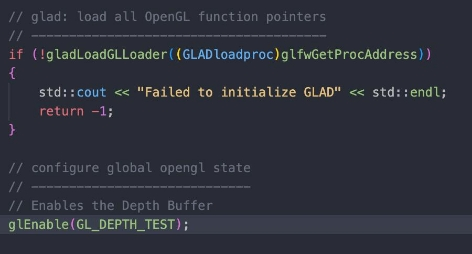
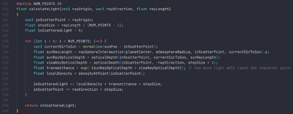

# AtmosphericScattering

<div style="display: flex;">
    
    
</div>


In this project we set out to create a simulation of the atmosphere in terms of how light that is emitted by a light source (in our case the sun) is scattered when the light enters the atmosphere. The main problem was to generate a realistic atmosphere with the proper light conditions according to the algorithms and equations presented by previous research. Rayleigh and Mie scattering are known methods which we investigated and finally implemented Rayleigh scattering. For the implementation we wrote code in C++ using the OpenGL library. 

---

## Project Links
[Link to project blog](https://docs.google.com/document/d/1VtaNd2OQC4ndTJ4I_rilJaA5PS81mg9ZAMXCypCPn2M/edit?usp=sharing)

[Link to project report](https://github.com/mharitsnf/AtmosphericScattering/blob/b4fffe57dcda326b0b3a82ca3d4fc94d938262e3/DH2323___Project_Report%20(1).pdf)

## How to run the project?
Firstly, go to branch `harits-dev` to get to the most updated development branch. There, On linux or other linux-based machines, run:
```
./configure.sh
./build.sh
./run.sh
```

## Notes
Make sure that in the external folder exists three folders: **glad**, **glew**, and **glfw**. If they don't exist, you need to run:
```
git submodule update --init --recursive
```
**Project Details**
<details>
    <summary>Project Set Up</summary>
    
The first thing we need to do is to set up the project environment. We will be using C++ with OpenGL for the actual application and CMake for compiling the application.

As for the development machines, Harits is using VS Code on a Mac, while Ben and Qinbai are using Visual Studio on Windows. It turns out that developing on different platforms and IDEs is not as easy as it seems. Thankfully, CMake supports cross-platform and it made the process much easier although we still had to face several problems.

For the first step, we need to set up the CMake first. There are several libraries that we use: GLFW, GLEW, GLAD, and GLM. To download those libraries into our project, we used git submodules as follows:

Git submodule add [git repository] external/[directory name]

This will add the git repository into the external/[directory name] folder. So in our case, we have external/glfw, external/glew, external/glad, external/glm. After fetching all the libraries, we need to tell CMake through CMakeLists to add subdirectory for each libraries:


Afterwards, we need to be sure to add the include (header files) and the src (C++ files, if any) to the CMakeLists as well:


To finalize the CMake set up, let’s link the libraries as well:


As Harits’ using Mac, which is a Unix-like environment, he created three shell executables for configuring, building, and running the application:


In the configure.sh file, we tell CMake not to add build docs in our build. We also tell CMake to build the current folder and put the result into the build subfolder. In the build.sh file, we change the current working directory (CWD) to build and execute the make command to actually build the application. Finally, in the run.sh file, we change the CWD to build and execute the binary.

</details>

<details>
    <summary>Setting Up a Window</summary>

After we managed to get the project working in all environments, we could start developing the application. We figure the first objective was to make a window to render our scene. Firstly, we need to set up OpenGL through GLFW and GLAD within the main function:


In these lines of code, we initialize and configure GLFW using the glfwInit and glfwWindowHint functions. For the glfwWindowHint functions, the first argument tells us what option we want to configure while the second argument sets the value of our option. Additionally, to make the application working on Mac devices, we need to add an extra configuration.




In this section, we tell GLFW to create a window with width and height set to the SCR\_WIDTH and SCR\_HEIGHT, with a title called “Atmospheric Scattering”. The if statement makes sure the window is actually created and terminates immediately if it isn’t. In figure x (second image), we initialize GLAD.


We also created a new function that listens to key presses and does actions accordingly called processInput. At this point, we only need to listen for the escape button that is used to terminate the application. We will expand this function in the next iterations to be able to listen to other key presses.


We also need to tell OpenGL to create a viewport that matches the size that we have defined. We created a callback function that handles that process called framebuffer\_size\_callback.


Finally, we need to create a render loop and to make sure everything is working, we created a colored window using the glClearColor function seen in figure x. The final result is seen below:


We figure we can make things more clean in our main code, so we decided to extract all the window configuration codes into the configure function:


The function takes a GLFWwindow\* &window argument so we can modify the window within the configure function. The function returns the status, and if the status values -1, an error occurs and the main function terminates.
</details>

<details>
    <summary>Adding Objects to the Scene</summary>

Once we have a window ready, the most logical step is to add objects to our scene. For us to actually have some objects in our scene, there are two main things we need to take care of first: setting up the object’s vertices and setting up the camera for calculating the projection. We worked on setting up the object’s vertices first.

The object we were adding was a cube to indicate the lighting object. Firstly, we need to declare the vertices of the cube in our main code. Here is the snippet of the vertices:


The first three columns are the position of the object in the object’s local space. The last three columns indicate the normal vector of the cube. Although the normal is not used due to the cube being the light source itself, we can keep the normal in the array if we want to add other cubes.

Next, we need to include this information into OpenGL through Vertex Buffer Objects (VBO). We first create two vertex buffer objects, one for the vertex position and the other one for the normal vectors. We also create a Vertex Array Object to contain our VBOs. This process can be seen below:


Now we have loaded a cube into OpenGL through the VBOs. But since the cube is still in the local space, we need to transform it to the screen space. This can be done by creating a Model View Projection matrix and multiplying each vertex with the matrix to get the projected value. Before we do that, we need to have a camera first that contains the projection information such as the focal length, the near and far plane, etc. We also specified the camera to be able to receive input from the user, so the user should be able to look around using the mouse and move around using the keyboard.

For the camera, we need to define the camera position and the rotation angles for the y axis (yaw) and the z axis (pitch). Once we have the two information, we can have the camera look direction as well. So first we created a header file called camera.h that handles all the camera data and logic:

Camera(glm::vec3 *position* = glm::vec3(0.0f, 0.0f, 0.0f), glm::vec3 *up* = glm::vec3(0.0f, 1.0f, 0.0f), float *yaw* = YAW, float *pitch* = PITCH, float *ppyaw* = PPYAW) : Front(glm::vec3(0.0f, 0.0f, -1.0f)), MovementSpeed(SPEED), MouseSensitivity(SENSITIVITY), Zoom(ZOOM) {

Position = *position*;

WorldUp = *up*;

Yaw = *yaw*;

Pitch = *pitch*;

PPYaw = *ppyaw*;

PPPitch = *pitch*;

updateCameraVectors();

}


The code above represents the constructor of the camera object. We only need to send the object the camera position since we have set up the default values for the camera data, such as the rotation values in angle, speed, and sensitivity. We also create two functions for handling the mouse and keyboard input:


After that, we modify the process input function in the main C++ file to be able to listen to WASD key presses:


We also created a mouse callback in the main C++ file that calculates the X and Y offset of the mouse movement, so we could translate them into rotation angles (fig. x). After that, we use the glfwSetCursorPosCallback(*window*, mouse\_callback); function in the configure function so the callback is used in the application.


Now the camera is all set up, we can actually get our MVP matrix. The MVP matrix will be used in a shader, so we need to create a shader as well. We also created a shader header file that handles the shader configuration by feeding the path to the vertex and the fragment shader. The file is too long to be screen captured, but it is accessible [here](https://github.com/mharitsnf/AtmosphericScattering/blob/harits-dev/shader_s.h). We also created functions that allow us to set uniforms in the shader by just specifying the name and the value for the uniform.

Now we create the vertex and fragment shader for the lighting cube:


The vertex shader just needs to receive three uniforms, the model, view, and projection matrix, and the vertex data that we will send from the main C++ file. While in the fragment shader, we only need to specify the color. We initialize the shader in the main C++ file:


Now that the shader is loaded, we can create an MVP matrix in the main loop after activating the shader:


For the model matrix, we can create an identity matrix first. We then translate the object to a desired position, and scale the object to however we like. As for the projection matrix, it can be created using GLM’s built-in perspective function that receives the focal length of the camera, aspect ratio, near plane, and the far plane. Finally, for the view matrix, we can also use GLM’s built in lookAt function that takes the camera position, the target (look direction) and the up direction:


Now that we have everything set up, we can render the lighting cube by binding the VAO that contains the object’s information and drawing the triangles in the main loop:


And here is the final result of the lighting cube:
</details>

<details>
    <summary>Loading the Planet</summary>

A 3D model comes in various formats, such as .fbx and .obj. For the planet, we intend to use a sphere. But in order to create a sphere in our scene, we need to make a loader for one of the 3D model extensions. We decided to create a loader for the .obj file due to its simplicity.

The .obj files come with a unique format; each line starts with a letter that denotes the type of the data for that line. For example, “v” stands for vertices, “vt” for UVs, and “vn” for normals. For our project, we took a simple OBJ files loader from a Github repository called *objloader.cpp*. To use the loader, we need to provide the OBJ file’s location and three vector arrays for storing the vertices, UVs, and normals.


We included a placeholder planet under the folder models calledobject2.obj. The rest of the step is very similar to adding the lighting cube, where we need to add the VBO and VAO, along with the vertex and fragment shader for the planet.


We added a basic lighting model for the planet so that it could have a simple lighting effect.


</details>

<details>
    <summary>Adding Post-processing Shader</summary>

As the atmospheric scattering effect will be displayed through post processing shaders, we need to set it up first. The basic idea is to render the camera view to a rectangle and display the rectangle to the viewport. By having a rectangle in between the rendering process, we can add a shader to the rectangle to do various stuff. Firstly, we need to specify the vertices for this rectangle early in the code:


Then we need to set up a framebuffer for the post-processing shader so that we can put the camera view onto a texture that can be processed in the shader (line 184 - 192 on the code snippet below). We still need to declare a VBO and VAO for the rectangle before adding the framebuffer so that the rectangle can be written to the scene as well. The whole step can be seen here:


We also have a Render Buffer Object (RBO) for adding depth onto the post-processing process. Now that we have the post-processing object ready, we can include a shader and attach it on the render loop. Our shader files are called postprocessing.vs and postprocessing.fs. For us to set the texture onto the shader, we can specify which frame buffer to use. Then, we also need to enable depth testing:


And then, we can reset the framebuffer to the default framebuffer after we have done everything in the render loop.


</details>

<details>
    <summary>Creating the Atmosphere</summary>

Setting up the camera within the shader

Now that we have the post-processing setup and ready to go, we can start creating the atmosphere. In the post-processing fragment shader, we need to have the original camera view ready as a texture. Next, we need to link the camera view direction and position between the C++ program and the shader program, so that whenever we modify the camera, the shader will be updated as well along with the effects in it. The whole step can be seen here:


Because conventional UVs for loading textures in shader consist of values from 0 to 1, and we want the center to bevec3(0, 0, -1) for the ray direction (-1 for the z element because the camera faces that way initially), we need to adjust the UV as seen in line 90 - 91. Then, we can specify the ray origin to be the same as the camera position (which will be updated every frame from the C++ program), and have the ray direction’s rotation adjusted to the camera’s rotation.

Making a plain atmosphere


The atmosphere is a sphere, and thus, we need to render a sphere in the shader program. To do that, we can render a sphere using the ray tracing principle, as seen in the code snippet above. The function takes the sphere’s center position, its radius, and the ray origin and direction. The function also returns a vec2 value which contains the distance from the camera to the sphere, and the distance from the entry point to the exit point of the sphere. By using this function, we can find the point where the ray enters the sphere and the point where the ray leaves the sphere (line 41). If the ray does not hit the sphere, we can set the return value toFLT\_MAX (line 45). We can then call this function in the main function (line 161). The sphere can be rendered and the result is as follows:

Rayleigh-Mie Scattering Implementation


To implement the Rayleigh-Mie scattering, we follow the specification provided in the [GPU Gems book](https://developer.nvidia.com/gpugems/gpugems2/part-ii-shading-lighting-and-shadows/chapter-16-accurate-atmospheric-scattering). Firstly, we need to understand how the algorithm works. The basic idea is to calculate the amount of light on every ray that goes through the atmosphere by sampling several points along the ray and calculating the amount of light scattered on each point. The visualization is as follows:


Now the number of points that go through the atmosphere can be decided by ourselves. The mathematical equation provided in the book uses integration, however, we can instead sample the number of points to keep the program real-time. Having more points means that the calculation will be slower, so we come up with an initial number of 30 points.

To calculate the scattering on each point, we need to examine two types of scattering model: Rayleigh and Mie. Rayleigh models smaller molecules (e.g., nitrogen, oxygen) while Mie models larger molecules (e.g., aerosols, pollution, etc.). In Rayleigh scattering, which we will be implementing, the molecules will scatter light more heavily on shorter wavelengths (i.e., blue) than on longer wavelengths (i.e., red). Meaning, when the sun is closer to the earth during noon, the blue wavelength will not be scattered as much, while during sunset and sunrise, the blue wavelength has been all scattered away, leaving the red-orange color we all know. These models can be calculated using the **phase function** provided in the book.

There is a term called “optical depth” which explains the average density of the atmosphere where the ray is traveling. The optical depth is used to calculate how much light will be scattered along a ray. The higher the value, the more light will be scattered, and the amount of light scattered will be increased exponentially if we decrease the value. There is another term called “transmittance” which explains how much light from the sun enters the in-scatter point after being scattered away by the atmosphere. The transmittance is calculated using the **out-scattering** equation. This is useful to calculate the two green lines (A - P5 and P5 - sun) on the figure above.

Another equation called the **in-scattering** equation is used to find how much light is added to a ray after the light is being scattered away by the atmosphere.

Now that we have the terms fleshed out, we can start implementing the light calculation function:



The function accepts the ray origin, direction, and length, and will return the in-scattered light. The function will loop through each point, calculating the out-scattering values between the point to the sun, and the camera to the point. The phase function is replaced by the exponential function at line 133, since the phase function provides an exponential result, and can be simulated using the exponential function to improve the performance. The out-scattering function can be seen here:


We also need to call all these functions within the main function:


And the result is as follows:


</details>

<details>
    <summary>Implementing the color</summary>

The shader is running, but it only accepts and returns a float. If we want to have the function behave properly, scattering the higher wavelengths more than the lower wavelengths, we need to adjust the function. In the C++, we can add a vector3 that holds the wavelength and scattering information:


The amount of scattering is inversely proportional to the fourth power of the wavelength, hence we created the scattering coefficients variable here. We also added the scattering strength variable as a way to play around with the scattering coefficients. We will also send the scattering coefficients to the shader. Next, we adjust the calculateLight function:


The function now accepts the original color from the screen and returns avec3 so that the color can be treated independently. We add the scattering coefficients to the in-scattered light variable because it affects how much light goes into the camera. Now that everything is setup, we can see the final result:
</details>


